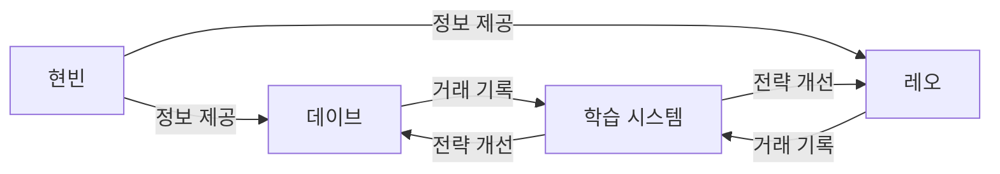

# 🚀 AI 트레이딩 팀 운영 가이드

> **협업 구조**: 현빈(정보 수집) → 데이브(보수적) + 레오(공격적) → 자가 학습

---

## 📋 팀 구성

### 1️⃣ 현빈 (정보 수집 전문가)
- **역할**: 암호화폐 시장 정보 실시간 수집
- **주기**: 5분마다
- **수집 항목**:
  - 🏛️ 연준(Fed) 이벤트 일정 (FOMC, CPI, NFP)
  - 😱 공포탐욕지수 (Fear & Greed Index)
  - 🌶️ 김치 프리미엄 (업비트 vs 바이낸스)
  - 🐋 고래 알림 (예정)
  - 📉 청산 맵 (예정)
  - 📰 암호화폐 주요 뉴스
- **출력**: `reports/research/crypto_market_intel.json`

### 2️⃣ 데이브 (보수적 트레이더)
- **역할**: 안정적 중장기 매매
- **전략**: 퀀트 3점 + LLM(Gemini) 검증 필수
- **타겟 코인**: BTC, ETH, SOL, XRP (메이저 코인)
- **익절/손절**: +2% / -1%
- **특징**: 연준 이벤트 고위험 구간 관망 (현빈 정보 참조)
- **주기**: 30초

### 3️⃣ 레오 (공격적 단타 트레이더)
- **역할**: 빠른 수익 실현 단타
- **전략**: 퀀트 1점 자동 진입 (LLM 없음)
- **타겟 코인**: DOGE, PEPE, NEAR, SUI, SEI, HBAR, STX (고변동성 알트)
- **익절/손절**: +5% (+3% 50% 청산) / -2%
- **특징**: 연준 이벤트를 변동성 기회로 활용 (데이브 반대 전략)
- **주기**: 10초
- **위험 관리**:
  - 일일 최대 손실: -5%
  - 3연속 손절 → 30분 휴식
  - 최대 3개 코인 동시 보유

---

## 🔄 협업 흐름



**상세 흐름**:
1. 현빈이 5분마다 시장 정보 수집 → JSON 파일 저장
2. 데이브가 30초마다:
   - 현빈 정보 확인
   - 연준 고위험 구간이면 신규 진입 금지
   - 공포탐욕 + 김치프리미엄 신호 참조
   - 퀀트 3점 + Gemini LLM 검증 후 매매
3. 레오가 10초마다:
   - 현빈 정보 확인
   - 연준 이벤트를 변동성 기회로 활용
   - 공포탐욕 극단 구간 보너스 점수
   - 퀀트 1점 이상 즉시 진입 (LLM 없음)
   - 데이브 보유 코인 피하기
4. 매일 자정:
   - 레오/데이브 거래 기록 분석
   - Ollama로 인사이트 생성
   - 전략 개선 사항 지식 파일에 추가

---

## 🚀 실행 방법

### 방법 1: 통합 스크립트 (권장)

```bash
cd d:\ai_lab\projects\ai-team\scripts
python start_trading_team.py
```

**실행 내용**:
- 현빈 (정보 수집 데몬)
- 데이브 (보수적 매매 데몬)
- 레오 (공격적 단타 데몬)

**종료**: `Ctrl + C`

---

### 방법 2: 개별 실행

#### 현빈만 실행
```bash
cd d:\ai_lab\projects\ai-team\skills\현빈_전략가\tools
python crypto_market_intelligence.py --daemon
```

#### 데이브만 실행
```bash
cd d:\ai_lab\projects\ai-team\skills\데이브_주식\tools
python upbit_auto_trader.py
```

#### 레오만 실행
```bash
cd d:\ai_lab\projects\ai-team\skills\레오_트레이더\tools
python leo_aggressive_trader.py
```

---

### 방법 3: 학습 스케줄러 실행

```bash
cd d:\ai_lab\projects\ai-team\scripts
python daily_trading_learning.py
```

**실행 내용**:
- 매일 00:00 자동 학습
- 즉시 실행: `python daily_trading_learning.py --now`

---

## 📊 모니터링

### 텔레그램 알림
- **시작/종료 알림**: 각 에이전트 가동/중지 시
- **거래 알림**:
  - 데이브: 매수/매도 시 즉시
  - 레오: 진입/익절/손절 즉시
- **정기 보고**:
  - 현빈: 5분마다 (수집 완료 시)
  - 데이브: 4시간마다
  - 레오: 2시간마다

### 로그 파일
- **현빈**: `reports/research/crypto_market_intel.json`
- **레오 거래 기록**: `reports/learning/leo_trade_log.jsonl`
- **레오 학습 지식**: `skills/레오_트레이더/knowledge/learned_strategies.md`

---

## ⚙️ 설정 조정

### 데이브 설정
**파일**: `skills/데이브_주식/tools/upbit_auto_trader.py`

```python
# 진입 점수 기준
if best["score"] >= 3:  # 3 → 2로 낮추면 더 공격적

# 감시 코인 추가/제거
TICKERS = [
    "KRW-SOL", "KRW-XRP", ...
]
```

### 레오 설정
**파일**: `skills/레오_트레이더/tools/leo_aggressive_trader.py`

```python
# 진입 점수 기준
if best["score"] >= 1:  # 1 → 0으로 낮추면 더욱 공격적

# 일일 손실 한도
MAX_DAILY_LOSS_PCT = -5.0  # -5% → -3%로 보수적 조정

# 익절/손절
tp1 = current_price * 1.03  # 1차 익절 +3%
tp2 = current_price * 1.05  # 2차 익절 +5%
sl = current_price * 0.98   # 손절 -2%
```

### 현빈 설정
**파일**: `skills/현빈_전략가/tools/crypto_market_intelligence.py`

```python
# 수집 주기
time.sleep(300)  # 300초(5분) → 60초(1분)로 단축 가능
```

---

## 🔧 트러블슈팅

### 1. API 키 오류
**증상**: "no_authorization_ip"

**해결**:
1. Upbit 웹사이트 로그인
2. 마이페이지 → Open API 관리
3. 현재 IP 주소 허용 목록에 추가

**현재 IP 확인**:
```powershell
Invoke-RestMethod -Uri "https://api.ipify.org?format=json" | Select-Object -ExpandProperty ip
```

---

### 2. 데이브와 레오 잔고 충돌
**증상**: "잔고 부족" 오류

**해결**:
- 레오는 자동으로 KRW 잔고의 40%를 데이브 예약금으로 제외
- 충돌 시 `leo_aggressive_trader.py`의 `dave_reserve = total_krw * 0.4` 조정

---

### 3. 현빈 정보 로드 실패
**증상**: "현빈 정보 로드 실패"

**확인**:
```bash
# JSON 파일 존재 확인
ls d:\ai_lab\reports\research\crypto_market_intel.json

# 내용 확인
cat d:\ai_lab\reports\research\crypto_market_intel.json
```

---

### 4. 학습 시스템 오류
**증상**: "거래 기록 없음"

**해결**:
- 최소 1일 거래 후 학습 가능
- 테스트 데이터 생성:
```bash
cd d:\ai_lab\projects\ai-team\skills\레오_트레이더\tools
python leo_learning_system.py --test
```

---

## 📈 성과 측정

### 일일 목표
| 에이전트 | 수익률 목표 | 승률 목표 | 손익비 |
|---------|-----------|----------|--------|
| 데이브 | +1~2% | ≥ 70% | 2:1 |
| 레오 | +3~5% | ≥ 60% | 1.5:1 |

### 주간 목표
| 에이전트 | 누적 수익률 | MDD |
|---------|-----------|-----|
| 데이브 | +5~10% | ≤ -5% |
| 레오 | +15~20% | ≤ -8% |

---

## 🛡️ 위험 관리

### 데이브
- ✅ EMA 200 대추세 필터
- ✅ LLM 최종 검증
- ✅ 연준 이벤트 관망
- ✅ 트레일링 스탑 (-3%)
- ✅ ATR 기반 손절 (2배)

### 레오
- ✅ 일일 최대 손실: -5%
- ✅ 3연속 손절 → 30분 휴식
- ✅ 5연속 손절 → 당일 거래 중단
- ✅ 시간당 최대 5회 거래
- ✅ 최대 3개 코인 동시 보유
- ✅ 데이브 보유 코인 회피

---

## 📚 학습 및 개선

### 자동 학습
- **주기**: 매일 00:00
- **분석 기간**: 최근 7일
- **분석 항목**:
  - 승률, 평균 수익/손실
  - 코인별 성과
  - 패턴 분석 (어떤 조건에서 승률 높았는가)
- **개선**:
  - 진입/청산 규칙 조정 제안
  - 감시 코인 리스트 업데이트
  - 점수 기준 재조정

### 수동 개선
1. 학습 지식 파일 확인:
   - `skills/레오_트레이더/knowledge/learned_strategies.md`
2. 제안 사항 검토
3. 코드 수정
4. 봇 재시작

---

## 🎯 다음 단계

### Phase 1 (완료)
- ✅ 현빈: 공포탐욕지수, 김치프리미엄 수집
- ✅ 데이브: 보수적 매매 전략
- ✅ 레오: 공격적 단타 전략
- ✅ 협업 구조 구축
- ✅ 자가 학습 시스템

### Phase 2 (진행 중)
- ⏳ 현빈: 고래 알림, 청산 맵 연동
- ⏳ 데이브: 학습 시스템 추가
- ⏳ 실전 운영 및 성과 측정

### Phase 3 (계획)
- 📋 온체인 지표 추가
- 📋 소셜 센티먼트 분석
- 📋 호가창 실시간 모니터링
- 📋 다중 거래소 지원

---

**⚠️ 면책 조항**: 암호화폐 거래는 고위험 투자입니다. 투자 원금 손실 가능성이 있으며, 모든 투자 결정은 본인 책임입니다.
