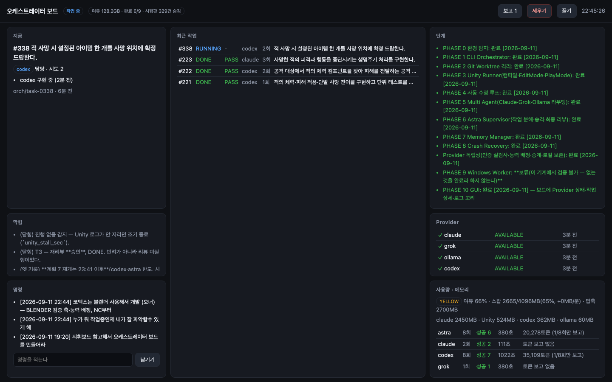
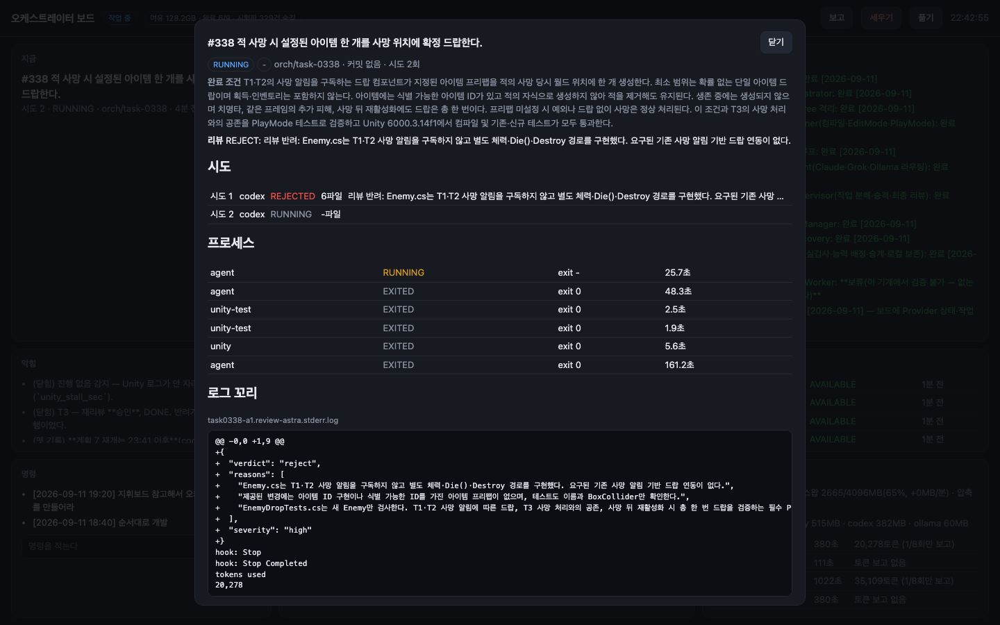

# 오케스트레이터 완료 보고 (2026-09-11)

한 줄 요약: **Unity 자율개발 오케스트레이터 `orch`는 PHASE 0~8·10과 Provider 독립성까지 만들어졌고, 무비용 시험 31종 전부 통과, 실제 유료 실행(계획 7)에서 T1~T3 완료·T4 진행 중이다.** PHASE 9(Windows Worker)만 이 기계에서 검증할 수 없어 만들지 않았다.

## 1. 무엇을 만들었나

원칙 하나가 전부를 지배한다: **AI가 "완료했다"고 말하는 것은 완료가 아니다.** 완료는 시스템이 직접 잰 것 — 실제 파일 변경, git diff, Unity 컴파일, 테스트 결과 — 로만 정한다. 아래 표는 코드로 강제되는 것만 적었다.

| 단계 | 내용 | 코드로 강제되는 것 |
|---|---|---|
| PHASE 0 환경 탐지 | Unity 6000.3.14f1·git·CLI 4종 위치 확인 | 없는 것은 시작 시 실패, 추측 없음 |
| PHASE 1 CLI Core | `./orch run/plan/run-plan/status/review/...` SQLite 상태 저장 | 재시작만으로 DONE이 되는 경로 없음 |
| PHASE 2 Git Worktree | 작업마다 격리 worktree·브랜치 `orch/task-NNNN` | 파괴적 git 명령 금지 목록, main 자동 병합 없음, diff는 merge-base 기준 |
| PHASE 3 Unity Runner | 배치 컴파일 + EditMode/PlayMode 테스트 | 검증 헬퍼(`Assets/Orch`) 변조·테스트 삭제 시 FAILED |
| PHASE 4 로그 분석·수리 루프 | 오류를 추출해 다음 시도에 주입, 로컬 요약(gemma) | 최대 3회, 인프라 실패는 시도 미차감 |
| PHASE 5 Multi Agent | Codex·Astra·Claude·Grok·Ollama 어댑터 + 승격 사다리 | 프롬프트는 stdin, 시크릿 env 스크럽 |
| PHASE 6 Planner·Reviewer | 목표를 T1~T6으로 분해, 별도 리뷰어가 최종 판정 | 리뷰 미실행이면 DONE 불가, 순환 의존 거부 |
| PHASE 7 Memory Manager | 여유 %·스왑 추세로 GREEN/YELLOW/RED, Unity 슬롯 축소 | 못 잰 값은 GREEN 아님, 남의 Unity는 절대 안 죽임 |
| PHASE 8 Crash Recovery | 주인 없는 RUNNING을 INTERRUPTED로 회수 | PID 재사용 방어, DONE으로 바꾸는 경로 없음, worktree 보존 |
| Provider 독립성 | 7상태·8능력, 실제 인증 검사, 장애 시 승계, 로컬 모드 | 설치≠사용가능, 승계 시 처음부터 다시 안 함, 위험한 것은 `BLOCKED_CLOUD_REQUIRED` 보존 |
| PHASE 10 GUI | 보드(이 화면) — 진행·막힘·단계·Provider·사용량·상세·보고 | 읽기 전용, 쓰는 것은 명령 줄·STOP뿐 |
| §15 토큰 | CLI가 스스로 보고한 값만 기록 | 어림수 금지 — 보고 없으면 "보고 없음" |
| §10 컨텍스트 상한 | 48,000자 안에서 피드백만 접음 | 목표·완료 조건·쓰기 범위는 절대 안 자름, 자른 사실을 프롬프트에 명시 |

코드 규모: Python 표준 라이브러리만, 외부 의존성 0. `orch_core/` 19개 모듈 + 어댑터 6개, 약 5,200줄.

## 2. 어떻게 검증했나

### 무비용 시험 — 네거티브 컨트롤 31종 (`tools/nc_suite.sh`)
게이트마다 **먼저 빨간불을 보여준 뒤** 초록을 믿는다. 모델 호출 0(`ORCH_NO_CLOUD=1` 잠금, 스크립트 에이전트). 이름 변경 직후 재실행 결과 **PASS 31 / FAIL 0, 230초.**

주요 케이스: 빈 변경 → FAILED · 컴파일 오류 → FAILED · 테스트 삭제 → FAILED · 검증 헬퍼 변조 → FAILED · 허용 범위 밖 파일 → FAILED · 리뷰 반려 → 재시도 · 리뷰 침묵 → DONE 불가 · CLI 없음/타임아웃 → UNKNOWN(시도 미차감) · 메모리 10판정 · 남의 Unity 제외 · 크래시 5판정 · Provider 분류(한도 오류가 **stderr에만** 와도 승계) · 인수인계 문서에 앞 담당의 변경이 실림 · 리뷰어 장애 승계 · 멎음 감지(일하는 것·로그 없는 것은 안 죽임) · Provider 대기(인증 만료는 안 기다림, 냉각은 재검사로 안 덮임) · 토큰(보고 없으면 빈칸) · 컨텍스트 상한(목표 보존).

### 실제 유료 실행 — 계획 7 (샌드박스 Unity, "적 체력·피해·사망·드랍")

| 과제 | 상태 | 시도 | 비고 |
|---|---|---|---|
| T1 체력·피해·단발 사망 | DONE · PASS | 1 | |
| T2 공격 경로 | DONE · PASS | 2 | Astra가 1차 실제 반려 → 재시도 통과 |
| T3 사망 생명주기 | DONE · PASS | 3 | 반려 2회 + 리뷰어 한도 → 재리뷰 승인 |
| T4 아이템 드랍 | **진행 중** (오너 재개 22:38) | 2 | 시도 1 Astra 반려: "T1·T2 사망 알림을 구독하지 않고 자체 Die() 경로를 만듦" — 요구사항 우회를 잡아냄 |
| T5 전투 데모 | 대기 | | |
| T6 통합 회귀 테스트 | 대기 | | |

실전에서 뚫린 자리 셋을 그 자리에서 고치고 NC로 봉했다: ①codex 한도 오류가 stderr로만 와서 코드 실패로 오판(→ `all_output`) ②리뷰어 한도가 UNKNOWN으로 뭉개짐(→ 리뷰어 승계) ③스왑 91%만으로 RED 오탐(→ 증가 추세가 있어야 RED). 토큰 실측도 이번 실행부터 살아 있다(Astra 20,278 · codex 35,109 토큰, 이전 기록은 열이 없던 시절이라 "보고 없음"이 맞다).

## 3. 화면

## 4. 오늘 고친 것 중 오너가 알아야 할 것

- **이름 충돌 수리**: 옛 AutoDev(금지·삭제)와 코드는 무관했지만 CLI·패키지 이름을 `autodev`로 지어 금지와 충돌했다. `orch`/`orch_core`/`ORCH_*`/`Assets/Orch`로 전부 갈랐다(동작 변경 0). 제가 한 번 `python3 -m`으로 우회 조회한 것도 잘못이라 원장에 적었다.
- **메모리 게이트를 느슨하게 한 것 하나**: 스왑 사용률만으로는 RED를 안 만든다. 실측(여유 71%·증가 0MB/분·스왑 91%)에서 오탐으로 매 작업 300초씩 기다리다 전멸했기 때문이다.

## 5. 안 한 것·다음

- **PHASE 9 Windows Worker**: 검증 수단이 없어 보류. 검증 못 하는 코드는 넣지 않는다.
- **받은 지시(22:44) "코덱스는 블렌더 사용해서 개발"**: Blender 배치(`blender -b -P`) 검증 축과 `BLENDER` 능력 배정이 필요하다. 다음 작업으로 잡는다 — NC부터.
- 계획 7 T4~T6 결과는 보드에서 실시간으로 보인다. 끝나면 이 보고 아래에 이어 적는다.

## 부록: 오늘 커밋 (오케스트레이터, 19건)
`836f0799` PHASE 1 → `4252182f` PHASE 2 → `7266e969` PHASE 3 → `7cf1d733` PHASE 4 → `0d7a3ffe` PHASE 5 → `6204947e` PHASE 6 → `b557ce48` PHASE 7 → `1b20a0d9` PHASE 8 → `0f871207`·`1482a45b` Provider 독립성 → `c3c0ea27` stderr → `397e2cfb` 리뷰어 승계 → `3a87e220` 메모리 오탐·냉각 파싱 → `4b1bc610` 문서 → `d6c674f0` PHASE 10 GUI → `d1cfc55b` 멎음 감지·Provider 대기 → `ddfdb306`·`921a830e` 토큰·컨텍스트 → `cc607855` 이름 변경
